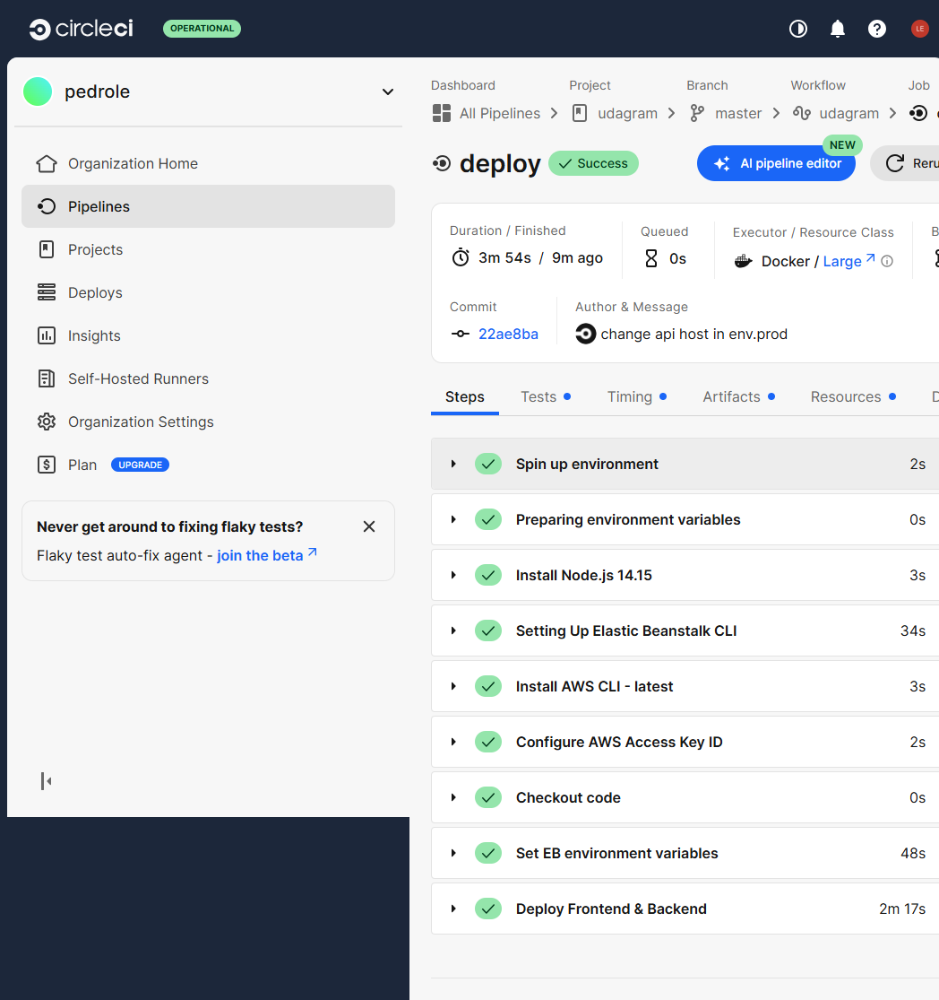
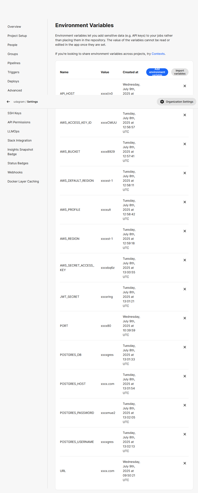

# Udagram Project – Full-Stack Application Deployment

## Overview
This project demonstrates the deployment of a cloud-native full-stack web application using AWS services. It includes:

- An **Node.js/Express** backend (API)
- An **Angular/Ionic** frontend
- A **PostgreSQL** database hosted on RDS
- Full **CI/CD** integration with CircleCI

The goal is to practice infrastructure setup, cloud deployment, and continuous delivery pipelines using real-world tools and workflows.

## Hosted Application

**Frontend URL:** http://udagram-frontend-959020458929.s3-website-us-east-1.amazonaws.com/
**API URL:** http://udagram-api-dev.us-east-1.elasticbeanstalk.com/

## Porject Structure

```bash
udagram/
├── .circleci/              # CircleCI pipeline configuration
├── udagram/udagram-api/            # Backend: Node.js Express API
├── udagram/udagram-frontend/       # Frontend: Angular/Ionic Web App
├── docs/                   # Documentation (infra, pipeline, dependencies)
├── package.json            # Root-level scripts
└── README.md               # Project overview

```
## Setup & Usage

### Environment Variables

All secrets are managed via CircleCI and .env files locally. No sensitive information is hardcoded in the repo.

Example variables:
- POSTGRES_USERNAME
- POSTGRES_PASSWORD
- AWS_BUCKET
- JWT_SECRET

### Installation

```bash
# Backend
cd udagram/udagram-api
npm install

# Frontend
cd ../udagram-frontend
npm install
```

### Running Locally
```bash
# Backend
npm run dev

# Frontend
npm start
```

## CI/CD Pipeline
- **Tool:** CircleCI
- **Workflow:**
  - Push to `master` → Triggers `build` → Manual `hold` → `deploy`
- **Deployment Targets:**
  - Backend: Elastic Beanstalk
  - Frontend: AWS S3
Refer to docs/Pipeline_description.md for a detailed explanation.

## Architecture Diagrams
Diagrams are located under the docs/ folder:
- Infrastructure Overview
- CI/CD Pipeline Flow

## Screenshots
- Last successful CircleCI build
	
  
  
- Elastic Beanstalk Environment
 
- AWS RDS instance

- S3 Static Website Hosting

- CircleCI environment variables

